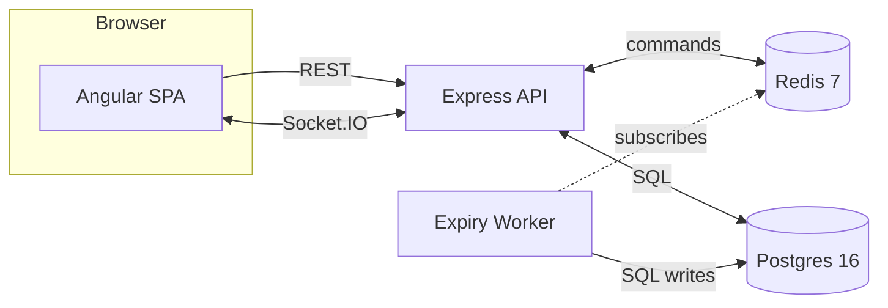
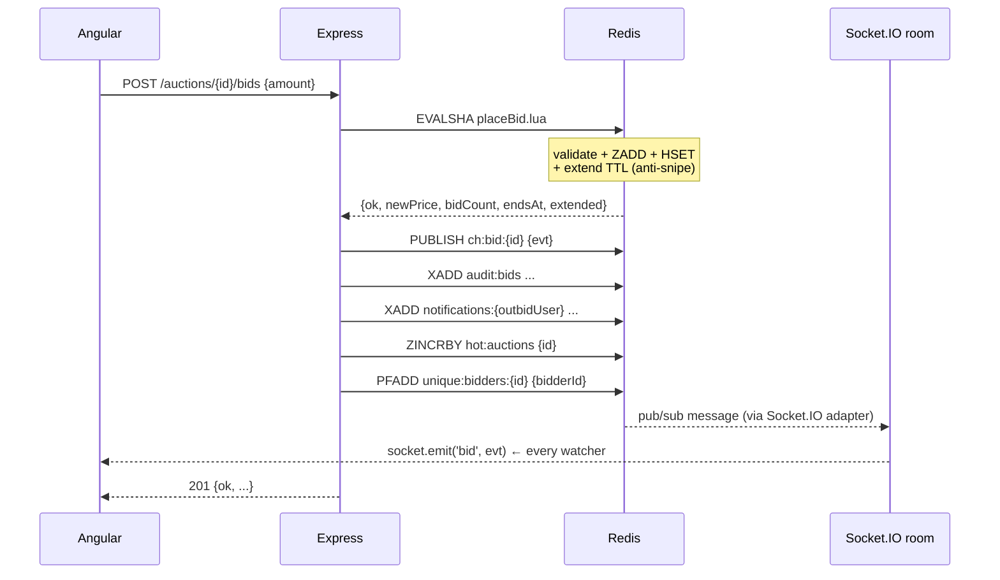
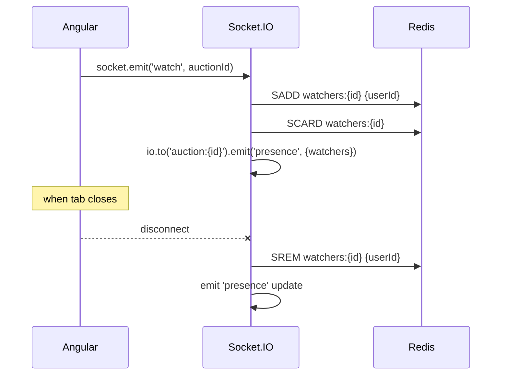

# Architecture

## High-level



Live state (auctions, bids, watchers, leaderboards, notifications) lives in **Redis**.
Permanent record (history, audit) lives in **Postgres**.

## Place a bid (Phase 4: Lua atomic)



## Auto-close on expiry (Phase 8)

```mermaid
sequenceDiagram
  participant R as Redis
  participant W as Expiry Worker
  participant P as Postgres
  participant SUB as Socket.IO

  Note over R: TTL on expire:auction:{id} hits zero
  R--xW: __keyevent@0__:expired = "expire:auction:{id}"
  W->>R: SET lock:close:{id} {token} NX EX 10
  alt lock acquired
    W->>R: HGETALL auction:{id}
    W->>R: HSET status=closed
    W->>P: UPDATE auctions SET status, winner, final_price
    W->>R: PUBLISH ch:closed:{id} {winner, price}
    W->>R: XADD notifications:{winner} type=won ...
    W->>R: DEL lock:close:{id} (Lua compare-and-delete)
    R-->>SUB: ch:closed fanout
  else lock NOT acquired
    Note over W: another worker is handling it; skip
  end
```

## Presence (Phase 6)


